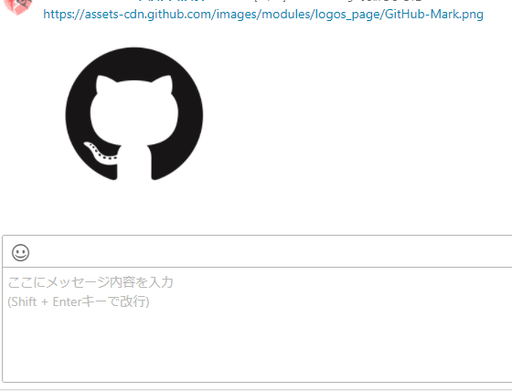
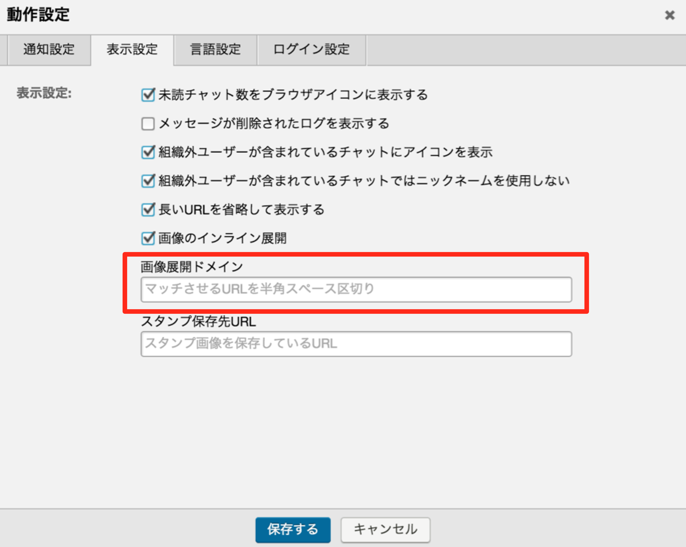
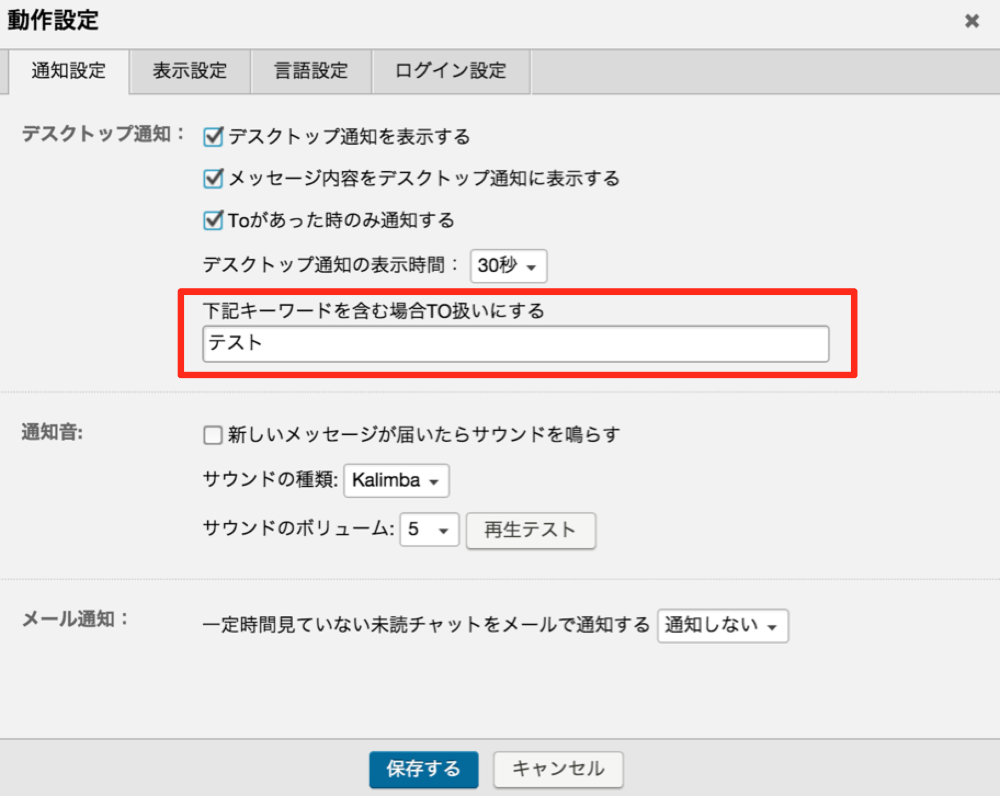
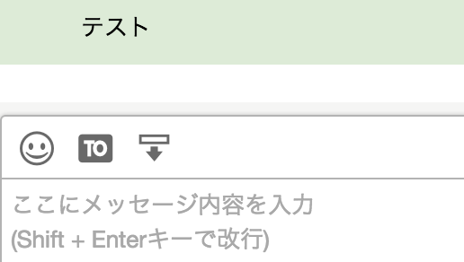
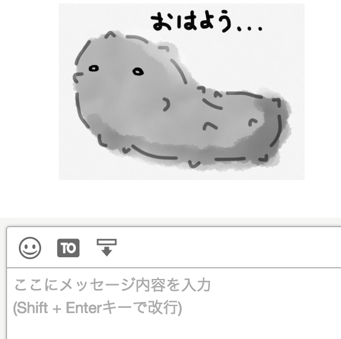
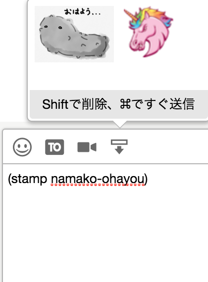
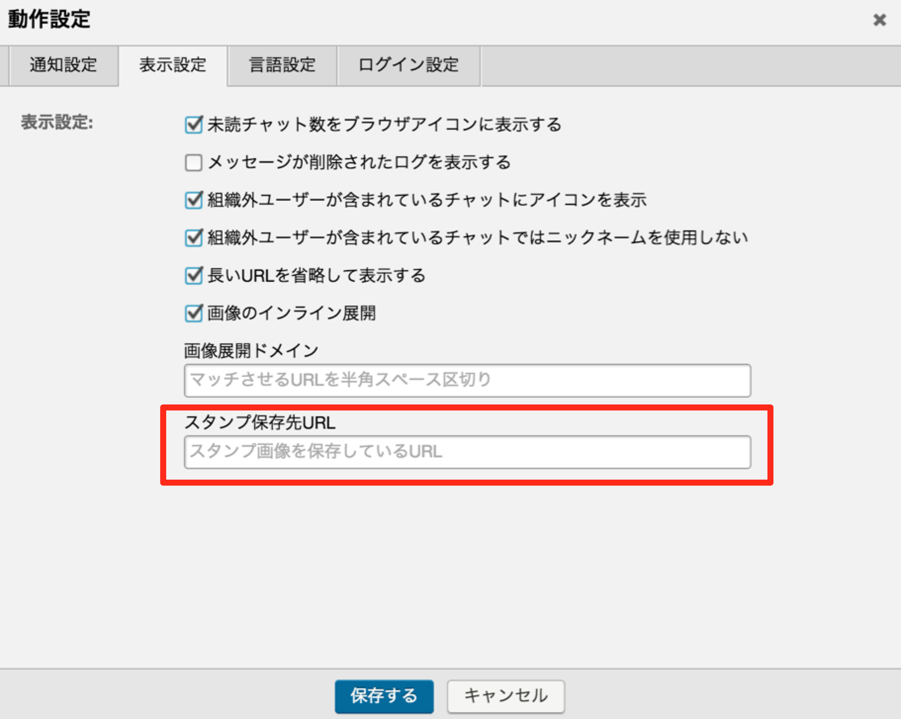

# chatwork-plugin
チャットワークになんか色々追加するchrome extension

# 目次
- [導入](#導入)
- [機能](#機能)
  - [画像をインラインで展開する](#画像をインラインで展開する)
  - [画像をモーダル表示する](#画像をモーダル表示する)
  - [(WIP)チャットルームをカテゴリで管理する](#チャットルームをカテゴリで管理する)
  - [(WIP)チャットルームアイコンの変更](#チャットルームアイコンの変更)
  - [特定のワードを含むメッセージを通知する](#特定のワードを含むメッセージを通知する)
  - [ルーム別に通知機能を切り替える](#ルーム別に通知機能を切り替える)
  - [チャット情報の変更を通知しない](#チャット情報の変更を通知しない)
  - [タグの自動展開](#タグの自動展開)
  - [スタンプ機能](#スタンプ機能)

## 導入
ダウンロードして「パッケージ化されてない拡張機能の読み込み」でとりあえずは・・・

## 機能

#### 画像をインラインで展開する
チャットに貼られた画像リンクを自動でインラインに展開する  
URLが「.gif, .png, .jpg, .jpeg」で終わっていれば設定なしで展開される

  
下図の設定箇所に記載されているURLから始まるリンクは末尾が上記の拡張子で終わっていなくても画像とみなして展開する  
半角スペース区切りで複数指定できる


#### 画像をモーダル表示する
インライン展開された画像をクリックするとモーダル表示を行う  
再度クリックで通常の画面に戻る  


#### チャットルームをカテゴリで管理する
作成中

#### チャットルームアイコンの変更
作成中

#### 特定のワードを含むメッセージを通知する
下図の設定箇所に記載したワードを含むメッセージをTO扱いにする




#### ルーム別に通知機能を切り替える
チャットタイトル右横の吹き出しをクリックでON/OFF出来る  
青い状態が通知ON・黒い状態が通知OFF  
TOもしくはREで送られたメッセージはこの設定に関わらず通知される


#### チャット情報の変更を通知しない
チャット情報の変更・ルームへの入室/退室を通知しない

#### タグの自動展開
チャット入力欄で\`\`\`で囲むとcode、\`\`iで囲むとinfo、\`\`tで囲むとtitleに自動展開される
```
```echo 'test';```
↓
[code]echo 'test';[/code]

``itest``i
↓
[info]test[/info]

``ttest``t
↓
[title]test[/title]
```

#### スタンプ機能
(stamp スタンプ名)と発言すれば対応するスタンプに展開される  
プラグイン非導入者にはそのまま(stamp スタンプ名)という文字列に見える


貼られているスタンプをクリックするとお気に入りリストに登録できる


  
スタンプ名 = ファイル名となるようにスタンプ画像を保存し  
下図の設定箇所にスタンプ画像が保存されているディレクトリのURLを設定する

