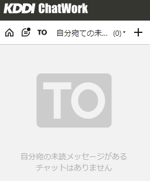
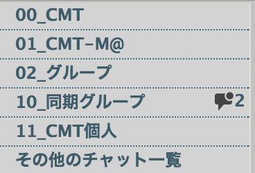
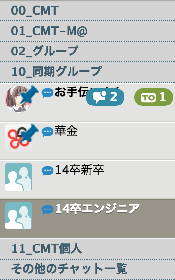
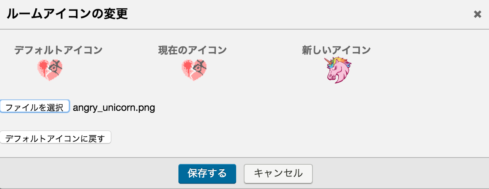
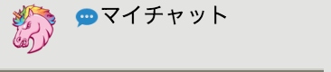

# chatwork-plugin
チャットワークになんか色々追加するchrome extension

# 目次
- [導入](#導入)
- [機能](#機能)
  - [自分宛ての未読機能・ショートカット](#自分宛ての未読機能・ショートカット)
  - [画像をインラインで展開する](#画像をインラインで展開する)
  - [画像をモーダル表示する](#画像をモーダル表示する)
  - [チャットルームをカテゴリで管理する](#チャットルームをカテゴリで管理する)
  - [チャットルームアイコンの変更](#チャットルームアイコンの変更)
  - [特定のワードを含むメッセージを通知する](#特定のワードを含むメッセージを通知する)
  - [コードブロックのシンタックスハイライト](#コードブロックのシンタックスハイライト)
  - [タグの自動展開](#タグの自動展開)

## 導入
chromeのextensionなのでダウンロードして拡張機能の「パッケージ化されてない拡張機能の読み込み」でとりあえずは・・・  
その他の環境でもUserScriptを読み込めるのなら、``built/bundle.js``とか``built/bundle.css``とかを読みこめば動くのではないか

## 機能

#### 自分宛ての未読機能・ショートカット
自分宛ての未読をフィルターする機能・1clickで切り替えられるショートカットの復元  


#### 画像をインラインで展開する
チャットに貼られた画像リンクを自動でインラインに展開する  
URLが「.gif, .png, .jpg, .jpeg」で終わっていれば設定なしで展開される  

  
下図の設定箇所に記載されているURLから始まるリンクは末尾が上記の拡張子で終わっていなくても画像とみなして展開する  
半角スペース区切りで複数指定できる  


#### 画像をモーダル表示する
インライン展開された画像をクリックするとモーダル表示を行う  
再度クリックで通常の画面に戻る  


#### チャットルームをカテゴリで管理する
Chatwork標準のカテゴリ機能を拡張  
登録したすべてのカテゴリを一覧で表示し、カテゴリに含まれないチャットをその他でまとめる  
カテゴリはカテゴリ名をクリックすることで折りたたむことも可能  
一番上の「チャット一覧」をクリックすると従来の表示に戻る  



#### チャットルームアイコンの変更
チャット一覧にあるルームアイコンをクリックすることで編集画面が開き、自分の好きなものに変更できる  
サーバ側のアイコンは書き換えず自分の表示だけをローカルに変更する  
  


#### 特定のワードを含むメッセージを通知する
下図の設定箇所に記載したワードを含むメッセージをTO扱いにする  
  


#### コードブロックのシンタックスハイライト
コードブロックのコードがシンタックスハイライトされる

#### タグの自動展開
チャット入力欄で\`\`\`で囲むとcode、\`\`iで囲むとinfo、\`\`tで囲むとtitleに自動展開される
```
```echo 'test';```
↓
[code]echo 'test';[/code]

``itest``i
↓
[info]test[/info]

``ttest``t
↓
[title]test[/title]
```
