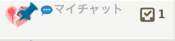

# chatwork-plugin
チャットワークになんか色々追加するchrome extension

## チャットワーク側の更新により動かないものがある可能性があります
# 目次
- [導入](#導入)
- [機能](#機能)
  - [画像をインラインで展開する](#画像をインラインで展開する)
  - [画像をモーダル表示する](#画像をモーダル表示する)
  - [チャットルームをカテゴリで管理する](#チャットルームをカテゴリで管理する)
  - [チャットルームアイコンの変更](#チャットルームアイコンの変更)
  - [特定のワードを含むメッセージを通知する](#特定のワードを含むメッセージを通知する)
  - [ルーム別に通知機能を切り替える](#ルーム別に通知機能を切り替える)
  - [ルーム別に自動既読を行う](#ルーム別に自動既読を行う)
  - [チャット情報の変更を通知しない](#チャット情報の変更を通知しない)
  - [コードブロックのシンタックスハイライト](#コードブロックのシンタックスハイライト)
  - [タグの自動展開](#タグの自動展開)
  - [スタンプ機能](#スタンプ機能)

## 導入
chromeのextensionなのでダウンロードして拡張機能の「パッケージ化されてない拡張機能の読み込み」でとりあえずは・・・  
その他の環境でもUserScriptを読み込めるのなら、``built/bundle.js``とか``built/bundle.css``とかを読みこめば動くのではないか

## 機能

#### 画像をインラインで展開する
チャットに貼られた画像リンクを自動でインラインに展開する  
URLが「.gif, .png, .jpg, .jpeg」で終わっていれば設定なしで展開される

  
下図の設定箇所に記載されているURLから始まるリンクは末尾が上記の拡張子で終わっていなくても画像とみなして展開する  
半角スペース区切りで複数指定できる


#### 画像をモーダル表示する
インライン展開された画像をクリックするとモーダル表示を行う  
再度クリックで通常の画面に戻る  


#### チャットルームをカテゴリで管理する
Chatwork標準のカテゴリ機能を拡張  
登録したすべてのカテゴリを一覧で表示し、カテゴリに含まれないチャットをその他でまとめる  
カテゴリはカテゴリ名をクリックすることで折りたたむことも可能  
一番上の「チャット一覧」をクリックすると従来の表示に戻る  


#### チャットルームアイコンの変更
チャット一覧にあるルームアイコンをクリックすることで編集画面が開き、自分の好きなものに変更できる  
サーバ側のアイコンは書き換えず自分の表示だけをローカルに変更する
  


#### 特定のワードを含むメッセージを通知する
下図の設定箇所に記載したワードを含むメッセージをTO扱いにする


#### ルーム別に通知機能を切り替える
ルームリストのチャットタイトル右横の吹き出しをクリックでON/OFF出来る  
青い状態が通知ON・黒い状態が通知OFF  
TOもしくはREで送られたメッセージはこの設定に関わらず通知される


#### ルーム別に自動既読を行う
チャットタイトル右横の吹き出しをクリックでON/OFF出来る  
青い状態が通常モード・黒い状態が自動既読モード  
自動既読になっているルームはリストで灰色で表示される  
※上記、通知機能のOFFと組み合わせるとTOも通知されず既読になってしまうので注意！！※  



#### チャット情報の変更を通知しない
チャット情報の変更・ルームへの入室/退室を通知しない

#### コードブロックのシンタックスハイライト
コードブロックのコードがシンタックスハイライトされる

#### タグの自動展開
チャット入力欄で\`\`\`で囲むとcode、\`\`iで囲むとinfo、\`\`tで囲むとtitleに自動展開される
```
```echo 'test';```
↓
[code]echo 'test';[/code]

``itest``i
↓
[info]test[/info]

``ttest``t
↓
[title]test[/title]
```

#### スタンプ機能
(stamp スタンプ名)と発言すれば対応するスタンプに展開される  
プラグイン非導入者にはそのまま(stamp スタンプ名)という文字列に見える  
画像を保存するためのサーバをどこかに用意する必要あり  


貼られているスタンプをクリックするとお気に入りリストに登録できる


  
スタンプ名 = ファイル名となるようにスタンプ画像を保存し  
下図の設定箇所にスタンプ画像が保存されているディレクトリのURLを設定する

